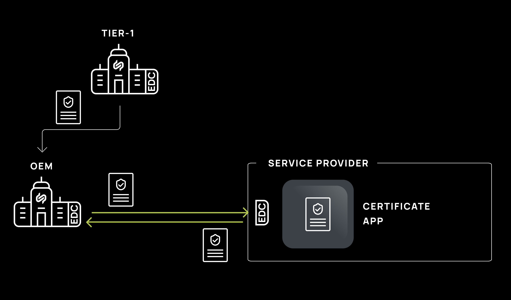
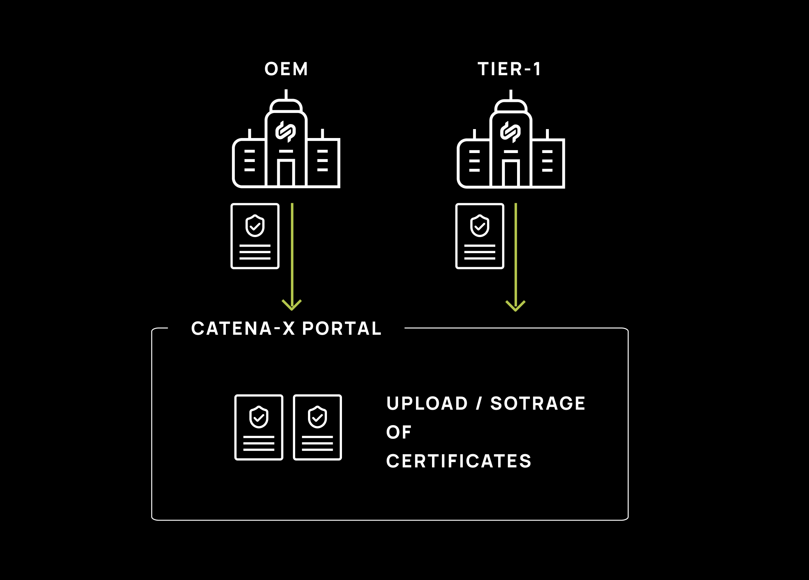

# Architecture Documentation

## Introduction and Goals

This architecture documentation should foster an understanding on how to utilize the BPDM certificate management KIT effectively. How to integrate the KIT or mainly the API into the application and make use of it.

This Kit covers various aspects, starting from how utilize the available API Endpoints, the used data models and how to make them available to the Catena-X network.

A solution provider should make the following information available for their customers:

- Get all certificates available for a specific BPN - business partner number
- Get a specific certificate (certificate type - e.g. IATF)  based on the BPN
- Get just the simple information whether a provided company based on the BPN is certified for a specific certificate type (true or false)
- Get the certificate document (e.g. the PDF file)
- Get a list of all available certificate types

A solution provider should be able to receive a certificate by a customer:

- Provide certificate data
- Provide a new certificate type

**Additional Information Material**:

- Visit BPDM on the official Catena-X Website: [bpdm_catenax_website](https://catena-x.net/en/offers-standards/bpdm)

## Goals Overview

The following goals have been established for this system:

| Priority | Goal |
| :--- | :--- |
| 1 | Enable network-based data sharing for business partner certificates to increase overall data quality and reliability |
| 2 | Enable also Small and medium-sized Businesses (SMEs) to use the services |
| 3 | Provide a change history for business partner certificate data |

## Requirements Overview

> :warning: **Note:** Cross-Check with CACs

## Quality Goals

| Priority | Quality Goal | Scenario |
|:---|:---|:---|
| 1 | Security | All users and services which access the Application must be authenticated and authorized. Consuming services/users are only allowed to read data. In addition they are only allowed to read the specific data that belongs with this, the Data Sovereignty principles of Catena-X has to be fulfilled |
| 2 | Integrity | All changes must be traceable and must be able to be rolled back |
| 3 | Legally | No natural persons are allowed to get uploaded and stored. For all other uploaded Business Partner data it is mandatory that users (CX Members) can only see their own uploaded certificate data and that it is not possible to draw conclusions about other business partner relationships |
| 4 | Integrity & Correctness |  It must be ensured that the data of the certificate record which is created during the process is correct. |
| 5 | Reliability | The Golden Record Application is a central foundation in the Catena-X Network. It provides all participants and services, business partner data and the unique Business Partner Number (BPN) as identifier. Therefore the BPDM Certificate Management Service must be always/highly available |
| 6 | Functional Stability |  Since the Golden Record Application is a central foundation in the Catena-X Network the defined standards of the API and datamodel for the associated Release Version must be fulfilled |
| 7 | Sensitivity of data | The uploaded business partner certificate data is highly sensitive, that's why it must be ensured that no unauthorized user/system can access data which does not belong to it. More over it must be guaranteed that no one can see the business partners related to the specific Catena-X Member. |

## Architecture Constraints

| Constraint ID | Constraint | Description |
|:---|:---|:---|
| C-1  | Software and third party software must be compliant to the Catena-X and Eclipse Foundation Guidelines/Policies [eclipse_foundation](https://www.eclipse.org/projects/dev_process/) |  |
| C-2 | [Eclipse Dataspace Connector](https://github.com/eclipse-tractusx/tractusx-edc/tree/main) must be used for data transfer between different legal entities |  |

## System Scope and Context

## Business Context

The following figure depicts the business context setup for :

The following are the various components of the business context setup:

### **Master Data Management (Catena-X Member)**

A backend system thats operated by a company / sharing member (e.g. Tier-1) which is participating in the Catena-X Ecosystem and consuming digital services or data assets.

### **Catena-X Portal/Marketplace (CX Portal)**

The Portal which provides an entry point for the Catena-X Members, to discover Apps that are offered in Catena-X.

### **Catena-X BPDM Certificate Management Application**

The Application which offers services to Catena-X Members and Catena-X Use Cases for consuming and processing business partner certificate data.

## Solution Strategy (High Level Picture)

The following high level view gives a basic overview about Components:

### **BPDM Certificate Management**

- The BPDM Certificate Management provides the interfaces for Catena-X Members to manage their business partner certificate data within Catena-X.
- For the current reference implementation, multi-tenancy is realized via a 1:1 deployment for each Catena-X Member. This means that every Catena-X Member who shares his business partner certificate data, has its own persistence.

## Keycloak Authentication & Autorization Flow

```mermaid

sequenceDiagram
    participant EDC of CX Member
    participant OpenIDConnect Server
    participant BPDM Certificate Management

    autonumber

    EDC of CX Member-->>OpenIDConnect Server: Send Client Credentials
    OpenIDConnect Server-->>EDC of CX Member: Respond OAuth2 Token
    EDC of CX Member -->> BPDM Certificate Management: Send Request with OAuth2 Token in Authorization Header
    BPDM Certificate Management -->> OpenIDConnect Server: Validate Token
    OpenIDConnect Server -->> BPDM Certificate Management: Confirms validity of Token
    BPDM Certificate Management -->> BPDM Certificate Management: Check "resource_access" section of OAuth Token

    
```

## Runtime View

### Upload Business Partner Certificate

The diagram below describes the flow of uploading a business partner certificate.

For further information about the different certificate types, please have a look on the Standards [CX - 00135 Business Partner Number](https://catena-x.net/de/standard-library)

```mermaid

sequenceDiagram
actor User

    autonumber
    Note over User, CertificateController: Path: api/catena/certificate/document
    Note over User, CertificateController: Method: POST

User ->> CertificateController : setCertificateDocument(certificateDocumentRequestDto)
activate CertificateController
CertificateController ->> CertificateService : createCertificate(certificateDocumentRequestDto)
activate CertificateService

CertificateService ->> InvalidBpnFormatException : validateCertificateBeforeProcess(certificateDocumentRequestDto) <br> [Does validation of BPN's format (BPNL, BPNS or BPN). IF formart is <br> not accordingly, InvalidBpnFormatException is thrown]

alt Invokes findCertificateType(certificateDocumentRequestDto.type)
CertificateTypeRepository -->> CertificateService : findByCertificateTypeAndCertificateVersion(certificateType, certificateVersion)  
CertificateService ->> CertificateTypeNotExists : If DB query does not return any values, CertificateTypeNotExists is thrown
end

CertificateService -->> CertificateMapping : Invokes toCertificateDB(certificateDocumentRequestDto, certificateType); 
activate CertificateMapping
note over CertificateMapping: Here Mapping of CertificateDocumentRequestDto to <br> CertificateDB occurs. All the fields are mapped accordingly
CertificateMapping -->> CertificateService : Return List<BpnCertifiedCertificateResponse>; 
deactivate CertificateMapping

CertificateService -->> CertificateRepository : save() [Save create CertificateDB object in the Database]  


CertificateService -->> CertificateController : Return CertificateDocumentResponseDto?; 
deactivate CertificateService
CertificateController -->> User : Return ResponseEntity<CertificateDocumentResponseDto>; 
deactivate CertificateController

    Note over User, CertificateController: Response: 201 OK 
    Note over User, CertificateController: Content-Type: application/json

```

### Query Certificate by Business Partner Number

```mermaid

sequenceDiagram
actor User

    autonumber
    Note over User, CertificateController: Path: api/catena/certificate/{bpn}
    Note over User, CertificateController: Method: GET

User ->> CertificateController : getCertificatesByBpnPaginated(bpn, pageRequest)
activate CertificateController
CertificateController ->> CertificateService : getCertificatesByBpn(bpn, pageRequest)
activate CertificateService

alt Triggers method if BPN insert starts with BPNL
CertificateService ->> CertificateRepository : findByBusinessPartnerNumber [If no Certificate is found by bpn, shows CertificateNotExists exception]
activate CertificateRepository
CertificateRepository -->> CertificateService : #32; 
deactivate CertificateRepository

CertificateService ->> ResponseMappings : Mapping of Page of CertificateDB to Page<CertificateDto>
activate ResponseMappings
ResponseMappings -->> CertificateService : #32;
deactivate ResponseMappings
end

alt Triggers method if BPN insert starts with BPNS
CertificateService ->> CertificateMapping : findByEnclosedSitesSiteBpn [If no Certificate is found by bpn, shows CertificateNotExists exception]
activate CertificateMapping
CertificateMapping -->> CertificateService : #32;
deactivate CertificateMapping

CertificateService ->> ResponseMappings : Mapping of Page of CertificateDB to Page<CertificateDto>
activate ResponseMappings
ResponseMappings -->> CertificateService : #32;
deactivate ResponseMappings
end

Note over CertificateService: If inserted BPN format is diferent of BPNL or BPNS, <br>InvalidBpnFormatException is shown

CertificateService -->> CertificateController : Return PageDto<CertificateResponseDto>; 
deactivate CertificateService
CertificateController -->> User : Return PageDto<CertificateResponseDto>; 
deactivate CertificateController

    Note over User, CertificateController: Response: 200 OK 
    Note over User, CertificateController: Content-Type: application/json


```

### Check Certificate availability by Type and Business Partner Number

```mermaid

sequenceDiagram
actor User

    autonumber
    Note over User, CertificateController: Path: api/catena/certificate/{bpn}/{certificateType}
    Note over User, CertificateController: Method: GET

User ->> CertificateController : checkCertificateByBpnAndType(bpn, certificateType)
activate CertificateController
CertificateController ->> CertificateService : checkCertificateByBpnAndType(bpn, certificateType)
activate CertificateService

CertificateRepository -->> CertificateService : findByCertificateType(certificateType); 
Note over CertificateService: If query done to database does not return a certificate by type, <br>CertificateTypeNotExists is thrown

alt Triggers method if BPN insert starts with BPNL (findCertificateByBusinessPartnerNumber)
CertificateRepository -->> CertificateService : findByBusinessPartnerNumber(bpn) [If no Certificate is found by bpn, shows CertificateNotExists exception]

alt Triggers method createCertifiedCertificateResponse(certificates, bpn, certificateType)
    note over CertificateRepository, CertificateService: Filter List<CertificateDB> retrieved earlier by type and bpn inserted
    
    alt
    CertificateService ->> CertificateMapping : If filtered List<CertificateDB> insn't empty, Mapping of CertificateDB to BpnCertifiedCertificateResponse <br> with isCertified assigned to true
    end

    alt
    CertificateService ->> CertificateMapping : If filtered List<CertificateDB> is empty, create listOf(BpnCertifiedCertificateResponse(bpn, false)) <br> with isCertified assigned to false
    end

end
end

alt Triggers method if BPN insert starts with BPNS (findCertificateByEnclosedSitesSiteBpn)
CertificateRepository -->> CertificateService : findByBusinessPartnerNumber(bpn) [If no Certificate is found by bpn, shows CertificateNotExists exception]

alt Triggers method createCertifiedCertificateResponse(certificates, bpn, certificateType)
    note over CertificateRepository, CertificateService: Filter List<CertificateDB> retrieved earlier by type and bpn inserted
    
    alt
    CertificateService ->> CertificateMapping : If filtered List<CertificateDB> insn't empty, Mapping of CertificateDB to BpnCertifiedCertificateResponse <br> with isCertified assigned to true
    end

    alt
    CertificateService ->> CertificateMapping : If filtered List<CertificateDB> is empty, create listOf(BpnCertifiedCertificateResponse(bpn, false)) <br> with isCertified assigned to false
    end

end
end

Note over CertificateService: If inserted BPN format is diferent of BPNL or BPNS, <br>InvalidBpnFormatException is shown

CertificateService -->> CertificateController : Return List<BpnCertifiedCertificateResponse>; 
deactivate CertificateService
CertificateController -->> User : Return List<BpnCertifiedCertificateResponse>; 
deactivate CertificateController

    Note over User, CertificateController: Response: 200 OK 
    Note over User, CertificateController: Content-Type: application/json


```

## Deployment View

### Applications Deployment without Kubernetes

```mermaid
C4Context

    Person(bpdm_user, "(Technical) User of the Business Partner Certificate Management APIs")

    System(cert_postgres, "Certificate Database" "Postgres: 14.5")


    Deployment_Node(cert_machine, "OS Environment", "Linux Alpine 3.16"){
        Deployment_Node(cert_java, "Runtime Environment", "JAVA RE 17") {
            Container(cert_container, "Business Partner Certificate Management Application", "Spring Boot: 3.1")
        }
    }

    Rel(bpdm_user, cert_container, "HTTP/S")
    Rel(cert_container, cert_postgres, "TCP/IP")

```

### Single Application Kubernetes Deployment

```mermaid
C4Context

    Person(cert_user, "(Technical) User of the the Business Partner Certificate Management APIs")

    Deployment_Node(kubernetes, "Kubernetes Environment", "Kubernetes 1.28"){

        Container(ingress, "Ingress", "Ingress Kubernetes Resource")
        Container(nginx, "Ingress Controller", "Nginx Reverse Proxy")
        Container(service, "Service", "Service Kubernetes Resource")

        Container(database, "Database Deployment", "Chart bitnami/postgres:11.9.13")

        Deployment_Node(deployment, "Deployment", "Deployment Kubernetes Resource"){
                Deployment_Node(replicaSet_1, "Replica Set", "Ingress ReplicaSet Resource"){
                    Deployment_Node(pod_1, "Pod", "Pod Kubernetes Resource"){
                        Container(container_1, "the Business Partner Certificate Management Application Container", "Spring Boot 3 on Linux Alpine 3.6")
                        Container(volume_1, "Config Volume", "Kubernetes Volume Mount")
                    }
        }
    }

    Deployment_Node(kubernetes_config, "Kubernetes Configurations", "Logical Grouping"){
        Container(configMap, "Application Configuration", "Kubernetes ConfigMap Resource")
        Container(secret, "Secret Configuration", "Kubernetes Secret Resource")

    }
}

Rel(cert_user, nginx, "Sends URL", "HTTPS")
Rel(ingress, nginx, "Routing Information")
Rel(nginx, service, "Routes to")
Rel(service, container_1, "HTTP")

Rel(container_1, volume_1, "mounts")
Rel(volume_1, configMap, "mounts")
Rel(volume_1, secret, "mounts")

Rel(container_1, database, "TCP/IP")

UpdateLayoutConfig($c4ShapeInRow="3", $c4BoundaryInRow="1")
```

## Crosscutting Concepts

### Business Partner Certificate Management Standards

[bp_cetificate_management_standards](https://catena-x.net/de/standard-library)

### Logging Behavior

As Spring Boot applications Business Partner Certificate Management employs Spring
specific [logging behavior](https://docs.spring.io/spring-boot/docs/3.0.0/reference/htmlsingle/#features.logging)

We enhance the default log entries with user request information including the determined user ID and a generated request ID.
Not all logs belong to an ongoing user request in which case these entries are empty.

In addition to the Spring standard logs the Business Partner Certificate Management applications keep a log of the following events:

- INFO: User requesting resource with resource name and HTTP verb
- INFO: Request HTTP response
- INFO: Update/Create Business Partners Certificate Types
- INFO: Creating Business Partner Certificate
- ERROR: Uncaught exceptions occurring in the service logic

## Quality Requirements

- see: [Quality Goals](#quality-goals)

## Risks and Technical Debts

### **Open EDC Questions**

- What capabilities will be provided in the future?
- How to deal with APIs provided behind an EDC? Swagger documentation cannot be seen by the requesting service?
- How can we authorize and authenticate a User/System with individual permissions after it passes the EDC?
- Will there by a Proxy EDC concept?
- ...
